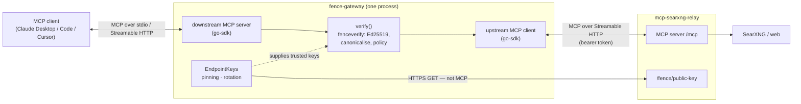
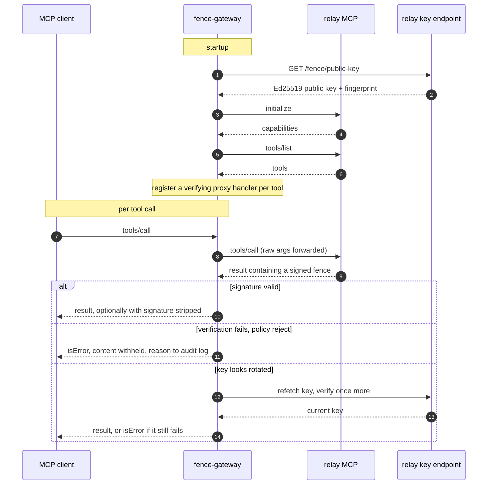

# Attribution

This project is an independent implementation of the work described in "Prompt Fencing: A Cryptographic Approach to Establishing Security Boundaries in Large Language Model Prompts" Peh S.

I read the paper and found the research interesting, and built this project as an engineering implementation of the ideas presented in it. The research, ideas, and methodology are attributed to the original author. The system architecture, engineering direction, integration, testing, and repository are my work, with AI-assisted development used extensively in implementing the code.

# fence-gateway

A verifying security gateway for prompt fencing (arXiv:2511.19727, Peh 2025), and
the missing counterpart to `mcp-searxng-relay`'s fence generator.

The relay signs every tool response. Until something checks those signatures they
are decoration — the relay's own `fence.go` says so in capitals. This is the
checker: the paper's "security gateway" (§4.5, §7.4.3), the component that performs
deterministic verification so the model never has to.

```
MCP client ──stdio──▶ fence-gateway ──http──▶ mcp-searxng-relay ──▶ SearXNG / web
                            │
                            └── verify · apply policy · audit
```

Status: proof of concept. Verified against output from the relay's unmodified
`fence.go` (see [Tests](#tests)).

## Components

| | |
|---|---|
| `fenceverify` | Package: parsing, canonicalisation, signature verification, key acquisition. No I/O in the hot path. |
| `fence-gateway` (module root, `package main`) | MCP proxy. Verifies tool results in transit and enforces a policy. This is the binary the `Dockerfile` builds. |
| `interop` | Interop test package: verifies output from the relay's unmodified `fence.go`. |

A standalone `fence-verify` CLI (read a fenced payload on stdin, exit 0/1/2, for
CI gates and incident triage) is described in the paper's tooling and is a
natural next addition on top of the `fenceverify` package, but is not yet
implemented in this repository.

## Architecture

The transport is delegated to the [MCP go-sdk](https://github.com/modelcontextprotocol/go-sdk)
— the same SDK the relay uses. The gateway is an **MCP server** to the
downstream client and an **MCP client** to the upstream relay, bridging the two
with fence verification injected on the return path. Verification itself
(`fenceverify`) is transport-agnostic and depends only on the standard library.



The return-path check is the whole point (§7.4.3): the model cannot be its own
security verifier, so a component in the transport does the deterministic
signature check before any bytes reach the model.



> The diagrams show the proxy's wiring; the client↔gateway leg runs over
> **stdio** (local) or **Streamable HTTP** (remote — with bearer auth and CSRF
> protection in front of the downstream server). See [Transports](#transports).

## Transports

The gateway speaks MCP over one of two transports, sharing the same verifying
proxy core:

- **stdio** (default) — a local subprocess of the MCP client. This is the
  per-workstation shape.
- **Streamable HTTP** (`MCP_PORT` set) — a network server, so one gateway can
  sit in front of the relay for a whole fleet instead of being installed on
  every workstation.

Configuration splits cleanly: **verification behavior is set by flags**
(`-upstream`, `-policy`, `-pin`, `-max-age`, `-strip-signature`,
`-require-all-fenced`, `-fence-version`, `-paper-scheme`, `-tofu`, `-key-url`), and
**deployment is set by environment variables** (mirroring the relay's names).
The tokens clients present *to the gateway* in HTTP mode are the
`MCP_AUTH_TOKEN*` family below. What the gateway presents *to the relay*
depends on `UPSTREAM_MCP_AUTH_MODE`: each caller's own credential, forwarded,
or the gateway's `UPSTREAM_MCP_TOKEN` for everyone. Which one you want is not a
detail — see [Which credential reaches the relay](#which-credential-reaches-the-relay).

## Quick start (stdio, local)

```bash
# Build the gateway binary (module root). Uses the MCP go-sdk for transport.
go build -o fence-gateway .
./fence-gateway -version

# In-line gateway (Claude Desktop config: point at this instead of the relay)
UPSTREAM_MCP_TOKEN="$RELAY_TOKEN" ./fence-gateway \
  -upstream http://relay.internal:8080/mcp \
  -pin 5fb07c6222c503de \
  -policy reject
```

## Running remotely (Streamable HTTP)

Set `MCP_PORT` to serve the Streamable HTTP transport; clients then point at the
gateway's URL instead of the relay's. Authentication is **mandatory** in this
mode (the endpoint is network-reachable) — a static bearer token, an OAuth 2.0 /
OIDC provider, or both — and cross-origin (CSRF) and DNS-rebinding protections
are on by default.

| Variable | Purpose |
|---|---|
| `MCP_PORT` | Serve HTTP on this port (unset ⇒ stdio). |
| `MCP_AUTH_TOKEN` | Single bearer token clients must present to the gateway. |
| `MCP_AUTH_TOKENS` | Comma-separated `identity:token` pairs (a small fleet). |
| `MCP_AUTH_TOKEN_FILE` | File of tokens, one `identity:token` per line (`#` comments allowed). |
| `MCP_TLS_CERT` / `MCP_TLS_KEY` | Serve HTTPS directly (both or neither). Omit to terminate TLS at a reverse proxy. |
| `MCP_STATELESS` | No session-ID issuance, so replicas need no sticky routing. Must match the relay's setting — see below. |
| `UPSTREAM_MCP_AUTH_MODE` | `static` (default), `passthrough` or `exchange` — which credential tool calls carry upstream. Required when more than one caller can reach the gateway. See below. |
| `UPSTREAM_MCP_TOKEN` | The gateway's own bootstrap credential for the relay. One per gateway, not one per caller. |
| `UPSTREAM_MCP_TOKEN_FILE` | The same credential read from a mounted file. Set one of the two, not both. |
| `UPSTREAM_OAUTH_TOKEN_URL` | `exchange` only: the identity provider's token endpoint (https). |
| `UPSTREAM_OAUTH_CLIENT_ID` / `UPSTREAM_OAUTH_CLIENT_SECRET` (or `_FILE`) | `exchange` only: the gateway's client at the provider, allowed to exchange tokens. |
| `UPSTREAM_OAUTH_AUDIENCE` | `exchange` only, optional: the relay's client ID, sent as `audience`. Keycloak needs it. |
| `UPSTREAM_OAUTH_DELEGATION` | `exchange` only, optional: also send the gateway's own token as `actor_token`, so the relay's token records the gateway acting for the user (`act`). Off by default. |

Static tokens must be ≥32 characters (`openssl rand -hex 32`).

**OAuth 2.0 / OIDC** (optional, an alternative or addition to static tokens):
the gateway acts as a Resource Server — it verifies a presented JWT's signature
and claims, never issues tokens. Only asymmetric algorithms are accepted (the
RS256→HS256 key-confusion class is rejected by construction), and it serves the
RFC 9728 protected-resource metadata a spec-compliant MCP client uses to
discover the issuer.

| Variable | Purpose |
|---|---|
| `MCP_OAUTH_ISSUER` | OIDC issuer URL. Its discovery document and JWKS are fetched at startup and rotated automatically. Setting this enables OAuth. |
| `MCP_OAUTH_AUDIENCE` | The `aud` tokens must carry (this gateway's identifier). Required with an issuer. |
| `MCP_OAUTH_JWKS_FILE` | Use a static JWKS file (hot-reloaded on change) instead of issuer discovery — for air-gapped deployments. |
| `MCP_OAUTH_IDENTITY_CLAIM` | Token claim to use as the audit identity (default `sub`). |
| `MCP_OAUTH_REQUIRED_SCOPE` | Require this scope (`scope` string or `scp` array) in the token. |
| `MCP_OAUTH_CA_ROOTS` | PEM file of CA roots for reaching a private issuer whose TLS cert is not in the system store. |
| `MCP_TRUST_FORWARDED_HEADERS` | Honour `X-Forwarded-Proto`/`-Host` when building the metadata URL (off by default). |

```bash
MCP_PORT=9090 \
MCP_AUTH_TOKEN="$(openssl rand -hex 32)" \
MCP_TLS_CERT=/etc/tls/tls.crt MCP_TLS_KEY=/etc/tls/tls.key \
UPSTREAM_MCP_TOKEN="$RELAY_TOKEN" \
./fence-gateway -upstream https://relay.internal:8080/mcp -policy reject -pin 5fb07c6222c503de
```

### Which credential reaches the relay

The relay derives caller identity *only* from the token it receives, and files
per-caller state under `identity | session` — its fetch history
(`searxng_session_sources`) and its rate-limit buckets both hang off that key.
A gateway that authenticates a client and then presents one credential of its
own for everybody collapses that key: two callers behind it share a history and
a rate limit, and the first can read the URLs the second fetched. `UPSTREAM_MCP_AUTH_MODE`
decides which of those two things happens.

| Value | Tool calls carry | Use when |
|---|---|---|
| `static` (default) | the gateway's own credential | one caller, or callers you are content to treat as one |
| `passthrough` | the calling client's own `Authorization`, forwarded verbatim | more than one caller shares the gateway, and the relay is reachable only from it |
| `exchange` | a token the identity provider issued to the relay for that caller (RFC 8693) | more than one caller, logging in with OAuth: the clean end state |

<picture>
  <source media="(prefers-color-scheme: dark)" srcset="docs/diagrams/relay-credential-modes-dark.svg">
  
</picture>

The dashed line is a caller trying to reach the relay directly with their own token.

Whatever the mode, **only the gateway may reach the relay**; in `passthrough` that is what
keeps callers from skipping it. [docs/deployment.md](docs/deployment.md) shows how, for
Podman/Compose and for the `searxng-helm` chart.

**`exchange`** closes the gap `passthrough` leaves. In `passthrough` the token a caller
holds for the gateway also works at the relay, so a caller who can reach the relay can skip
the gateway and its checks. In `exchange` the gateway trades each caller's OAuth token at the
identity provider for a token issued to the relay for the same user, and presents that. The
caller's own token is only good at the gateway. The relay needs no change: point its
`MCP_OAUTH_ISSUER` and `MCP_OAUTH_AUDIENCE` at the provider and client that issue the
exchanged tokens. Callers must log in with OAuth; a static-token caller is refused. The gateway
authenticates its own housekeeping with a client-credentials token from the same client, or
with `UPSTREAM_MCP_TOKEN` when that is set. Setup for authentik and Keycloak is in
[docs/token-exchange.md](docs/token-exchange.md).

With more than one caller (several static tokens, or OAuth, where every subject is a
caller), the gateway refuses to start until `UPSTREAM_MCP_AUTH_MODE` is set. Sharing one
relay identity is then a choice you made, not a default you missed.

Pass-through needs HTTP mode (stdio has no downstream credential to forward)
and keeps the relay unchanged: the tokens in the relay's table are the same
values the clients already present to the gateway, so it resolves each caller
to its own identity exactly as it does without a gateway in the way. A call
that arrives with nothing to forward is refused rather than sent under the
gateway's credential — falling back would quietly restore the collapse.

`UPSTREAM_MCP_TOKEN` (or `UPSTREAM_MCP_TOKEN_FILE`, for orchestrators that
mount secrets rather than inject them) is then the **bootstrap credential**:
one per gateway, never one per caller. It authenticates `initialize` and
`tools/list` at startup — both happen before any client exists — and the
housekeeping the SDK does with no caller attached: ping and session
DELETE. No tool call uses it in pass-through mode. So a deployment with
N callers holds N + 1 secrets, not 2N.

Because pass-through forwards whatever header the client sent, a JWT rides
through untouched: point both the gateway and the relay at the same OIDC issuer
and identity flows end to end in `sub` with no shared secrets at all, provided
the token's `aud` satisfies both sides' `MCP_OAUTH_AUDIENCE`.

`MCP_STATELESS` mirrors the relay's variable of the same name — no session-ID
issuance, every request its own ephemeral session, so replicas need no sticky
routing. **Set it the same on both.** A stateless gateway in front of a
stateful relay breaks the affinity chain in the middle, leaving the relay's
session state stranded on whichever replica answered first.

Against a stateful relay, the gateway replaces its upstream session whenever the relay
drops it: after a relay restart, or when the relay's janitor closes the session
(`MCP_SESSION_MAX_AGE`, seven days by default). The call that finds the session gone
reconnects under the gateway's own bootstrap credential and is retried once, so callers
do not see it. The audit log records `upstream.session.lost`.

### Container

The gateway ships as a minimal, reproducibly-built container image
(`FROM scratch`, non-root, statically linked). Over stdio, run it with an
attached stdin (`-i`); in HTTP mode, publish the port. Secrets come from the
runtime environment, never baked into the image:

```bash
# stdio
docker run --rm -i \
  -e UPSTREAM_MCP_TOKEN=… \
  ghcr.io/littleoffice/fence-gateway:latest \
  -upstream https://relay.internal:8080/mcp -policy reject -pin 5fb07c6222c503de

# Streamable HTTP (remote)
docker run --rm -p 9090:9090 \
  -e MCP_PORT=9090 -e MCP_AUTH_TOKEN=… -e UPSTREAM_MCP_TOKEN=… \
  ghcr.io/littleoffice/fence-gateway:latest \
  -upstream https://relay.internal:8080/mcp -policy reject -pin 5fb07c6222c503de
```

Build it yourself reproducibly with `./build.sh <version>` (podman), or see
[`docs/supply-chain.md`](docs/supply-chain.md) for the full build-provenance,
reproducibility, and release-attestation story,
[`docs/SECURITY.md`](docs/SECURITY.md) for vulnerability reporting, and
[`docs/conformance.md`](docs/conformance.md) for how the gateway maps onto the
paper's Security Gateway (§4.5, §7.4.3).

`-policy` is `reject` (Definition 4.5 rule 4 — drop the result), `annotate` (forward
with a warning and `isError`), or `audit` (log only). Only `reject` actually stops an
attack; the other two describe one.

A text block with no fence at all is a failure too, and the policy applies to it. A
substituted relay, or anyone on a plain-HTTP link, does not need to forge a signature to
reach the model; it only has to leave the fence out. Two replies the relay sends unfenced
are let through: the exact text `No results found.`, and error results, which are
shortened and labelled as unverified so a failed fetch still reads as a failed fetch.
`-require-all-fenced` goes further and accepts nothing unsigned, those two included.

## Reconciling the paper with the relay

Four places where the two disagree, and what the verifier does about each.

**Signature construction.** §4.3 specifies `Ed25519(SHA-256(C ‖ M))`. The relay signs
`"PromptFence/v1.0" ‖ 0x00 ‖ uint64_be(len(C)) ‖ C ‖ M` with PureEd25519 and explains
why. The relay is right, so `SchemeRelay` is the default; `-paper-scheme` selects the
literal construction for interop with the reference implementation. The two do not
cross-verify, and a test asserts they don't.

**Escaping.** The relay signs pre-escape content and emits escaped content, so the
verifier must unescape before checking. It does so in a single left-to-right pass over
exactly three entities. A general XML unescaper is wrong here: content containing the
literal text `&lt;` arrives on the wire as `&amp;lt;`, and anything entity-table-driven
turns it into `<` — different bytes than were signed, silent failure. There is a test.

**Encoding.** `searxng_session_sources` carries byte-exact URLs, so the relay sends its
body as CDATA (`encoding="cdata"`) rather than entity-escaped. The verifier branches on
that attribute: it finds the element's end by skipping over CDATA sections (a page title
may contain a literal `</sec:fence>`), joins the sections, and refuses any text outside
them. An `encoding` value it does not know is refused, not guessed at. The attribute is
signed, so flipping it breaks the fence.

**Canonicalisation.** Attribute values are reconstructed from the raw wire bytes rather
than parsed-then-re-escaped, so the canonical string is rebuilt from the same bytes the
signer saw. Every attribute is canonicalised, including unrecognised ones — otherwise a
smuggled `policy="allow-all"` would ride along outside the signature while still being
visible to the model. `xmlns:*` and `signature` are excluded, matching the generator.

**The nonce.** Not in the paper; a relay extension. §4.3's extensibility clause covers
it — new attributes join the alphabetical canonicalisation and are signed like any other.
`-require-nonce` is on by default in the gateway.

## What this found

**Prose mentions of the syntax are not attacks.** The relay's awareness preamble
discusses `<sec:fence rating="untrusted">` and `</sec:fence>` in plain text, so the
first textual match in every genuine response is not the real element. Two consequences.
First, the real fence has to be located by trying candidates and letting the signature
decide, because any pattern-based selector is something content can steer. Second — and
this only showed up on the first live run — treating unparseable candidates as
rejections makes `-policy reject` block *100% of legitimate traffic*. Candidates are now
split: those carrying a `signature=` attribute are asserting authenticity and failing
(→ `Rejections`, alert on these), those without are prose (→ `Ignored`).

**The awareness preamble is unsigned.** It sits outside the fence, and it is the text
instructing the model to treat the fenced content as data. Nothing binds it to the fence
it describes. Untrusted content cannot currently reach it — it is escaped and enclosed —
so this is not presently exploitable in the relay. But the mechanism it protects is
defeated by editing it, without touching a signature, and §4.2 assumes every segment is
fenced. `-require-all-fenced` surfaces the gap; the real fix is to wrap the preamble in
its own `rating="trusted" type="instructions"` fence, which is what the paper prescribes
for system instructions anyway.

The relay now does this under `FENCE_PREAMBLE=fenced` (format 1.1). But a signature only
covers its own fence: cut the preamble out, or splice a preamble from one response onto
another's content, and everything left still verifies. So the gateway also checks how the
fences fit together. Under 1.1, each content fence must follow a trusted preamble fence
(`source="mcp-searxng-relay:awareness"`) that names its nonce and shares its key and
timestamp. All fences in a response must share one format. A trusted fence can only be
that preamble. And a response in an older format than the relay's key endpoint reports is
a downgrade, unless a re-read of the endpoint shows the relay was rolled back. Any of
these is a failure, and the policy applies.

`-fence-version` sets the oldest format accepted outright. `auto` (the default) follows
the key endpoint as above, because the relay itself defaults to 1.0. `1.1` requires the
signed preamble on every response, and is the setting to use once the relay runs with
`FENCE_PREAMBLE=fenced`. `1.0` accepts either relay format but refuses fences with no
version, which only other producers emit. If the relay reports an older format than
required at startup, the gateway logs `fence.version.mismatch`, since every result
would then be blocked.

**Signatures carry no freshness.** A valid fence is valid forever. Anything that caches
or replays tool output can feed stale content into a live session with a perfect
signature. `-max-age` bounds it against the fence timestamp: 10 minutes by default,
since the relay stamps each fence when it answers. A fence dated more than two minutes
ahead of the gateway's clock is refused too, so it cannot outlive the bound. Both depend
on the relay's and the gateway's clocks roughly agreeing; `-max-age 0` turns the age
check off.

**Ephemeral keys bound what verification proves.** Fetching the key from the same server
that produced the fence is *not* circular under the paper's threat model (§2.2) — the
adversary there controls fetched content, not the relay process, and a malicious page
cannot mint signatures however many fake fences it embeds. That is the §6.3.2 defence and
it holds. Against a substituted or impersonated relay it proves nothing, which is what
`-pin` is for. But pinning fights the relay's per-restart key generation: the gateway has
to tolerate rotation (it refetches once on failure and retains the previous key per
§7.4.1) and a pinned deployment needs operator action after every relay restart. This is
the single biggest limiter on what the signatures are currently worth, and it is a relay
lifecycle question, not a gateway one.

The relay now answers it: `FENCE_SIGNING_KEY_FILE` gives it a persistent key (the
`searxng-helm` chart mounts one via `fenceKey.existingSecret`), so a pin survives its
restarts. **Relay persistent key + gateway `-pin` is the setup to run.** The gateway
enforces the floor:

| Key source | Startup |
|---|---|
| `-pin` set | starts; the transport does not matter, the key must match the pin |
| no pin, key over HTTPS or from this machine (`localhost`, `127.0.0.1`, `::1`) | starts, with a `fence.key.unpinned` warning |
| no pin, key over plain HTTP from another machine | **refused**: anyone on the path could serve their own key |

Each fence names the key that signed it (`kid`), and the gateway checks it against that
key alone. So "signed by a key I do not hold" and "forged" are told apart in the audit
log. A fence naming a key the gateway does not have (a new rotation, or another relay
replica) makes it fetch the endpoint until that key turns up, up to four times, at most
once per key every two seconds. Keys the relay has stopped using drop out after a day.
Several replicas on keys of their own therefore work, but they cannot be pinned: a pin
accepts one key. Give all replicas the same key to pin them.

`-tofu` does not count as a pin: its first fetch has the same problem, and it is
remembered only until the gateway restarts. A malformed `-pin` (not 16 hex characters)
stops startup instead of silently matching no key; upper case is accepted.

## Tests

```
fenceverify   round trips, escaping edge cases, CDATA bodies, tampering, forgery,
              smuggled attributes, duplicate attributes, rotation, both schemes,
              staleness, malformed input
interop       16 vectors from the relay's unmodified fence.go: both layouts
              (1.0 prose preamble, 1.1 fenced preamble) × escaped and CDATA
              bodies, plus tampering of each
gateway       end-to-end over HTTP: pass, block, annotate, rotation recovery,
              pin enforcement, signature stripping; the interop vectors run
              through the policy
```

The interop tests matter more than their size suggests: everything else verifies against
this package's own generator, which would hide any bug symmetric across both sides. The
vectors live in `interop/testdata/relay` and come from the relay commit pinned in
`RELAY_COMMIT` there. `interop/regen.sh` rebuilds them, and CI rebuilds them into a
scratch directory on every run and tests the fresh output too. To move to a newer relay,
change the pin, run the script, and commit the result.

## Licence

The paper is CC BY 4.0. This implementation is offered under Apache 2.0 license.
