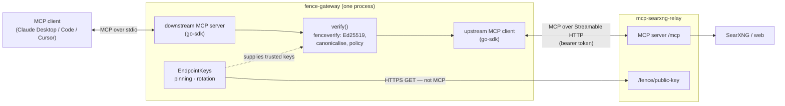
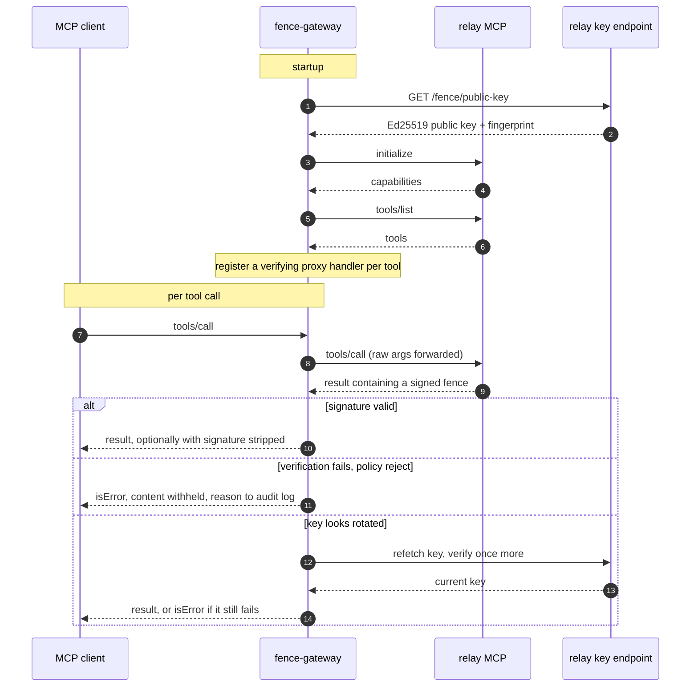

# Attribution

This project is an independent implementation of the work described in "Prompt Fencing: A Cryptographic Approach to Establishing Security Boundaries in Large Language Model Prompts" Peh S.

I read the paper and found the research interesting, and built this project as an engineering implementation of the ideas presented in it. The research, ideas, and methodology are attributed to the original author. The system architecture, engineering direction, integration, testing, and repository are work of littleoffice, with AI-assisted development used extensively in implementing the code.

# fence-gateway

A verifying security gateway for prompt fencing (arXiv:2511.19727, Peh 2025), and
the missing counterpart to `mcp-searxng-relay`'s fence generator.

The relay signs every tool response. Until something checks those signatures they
are decoration — the relay's own `fence.go` says so in capitals. This is the
checker: the paper's "security gateway" (§4.5, §7.4.3), the component that performs
deterministic verification so the model never has to.

```
MCP client ──stdio──▶ fence-gateway ──http──▶ mcp-searxng-relay ──▶ SearXNG / web
                            │
                            └── verify · apply policy · audit
```

Status: proof of concept. 30 tests, including verification against output from
the relay's unmodified `fence.go`.

## Components

| | |
|---|---|
| `fenceverify` | Package: parsing, canonicalisation, signature verification, key acquisition. No I/O in the hot path. |
| `fence-gateway` (module root, `package main`) | MCP proxy. Verifies tool results in transit and enforces a policy. This is the binary the `Dockerfile` builds. |
| `interop` | Interop test package: verifies output from the relay's unmodified `fence.go`. |

A standalone `fence-verify` CLI (read a fenced payload on stdin, exit 0/1/2, for
CI gates and incident triage) is described in the paper's tooling and is a
natural next addition on top of the `fenceverify` package, but is not yet
implemented in this repository.

## Architecture

The transport is delegated to the [MCP go-sdk](https://github.com/modelcontextprotocol/go-sdk)
— the same SDK the relay uses. The gateway is an **MCP server** to the
downstream client and an **MCP client** to the upstream relay, bridging the two
with fence verification injected on the return path. Verification itself
(`fenceverify`) is transport-agnostic and depends only on the standard library.



The return-path check is the whole point (§7.4.3): the model cannot be its own
security verifier, so a component in the transport does the deterministic
signature check before any bytes reach the model.



> The diagrams show the current stdio deployment. A **Streamable HTTP**
> transport — so one gateway can serve a fleet remotely, with bearer auth and
> CSRF protection in front of the downstream server — is in progress.

## Quick start

```bash
# Build the gateway binary (module root). Uses the MCP go-sdk for transport.
go build -o fence-gateway .
./fence-gateway -version

# In-line gateway (Claude Desktop config: point at this instead of the relay)
./fence-gateway \
  -upstream http://relay.internal:8080/mcp \
  -token "$MCP_AUTH_TOKEN" \
  -pin 5fb07c6222c503de \
  -policy reject
```

### Container

The gateway also ships as a minimal, reproducibly-built container image
(`FROM scratch`, non-root, statically linked, two files in the runtime layer).
It speaks JSON-RPC over stdio, so run it with an attached stdin (`-i`):

```bash
docker run --rm -i ghcr.io/littleoffice/promptfence-gateway:latest \
  -upstream https://relay.internal:8080/mcp \
  -policy reject -pin 5fb07c6222c503de

# Secrets come from the runtime environment, never baked into the image:
docker run --rm -i -e MCP_AUTH_TOKEN=… ghcr.io/littleoffice/promptfence-gateway:latest …
```

Build it yourself reproducibly with `./build.sh <version>` (podman), or see
[`docs/supply-chain.md`](docs/supply-chain.md) for the full build-provenance,
reproducibility, and release-attestation story, and
[`docs/SECURITY.md`](docs/SECURITY.md) for vulnerability reporting.

`-policy` is `reject` (Definition 4.5 rule 4 — drop the result), `annotate` (forward
with a warning and `isError`), or `audit` (log only). Only `reject` actually stops an
attack; the other two describe one.

## Reconciling the paper with the relay

Four places where the two disagree, and what the verifier does about each.

**Signature construction.** §4.3 specifies `Ed25519(SHA-256(C ‖ M))`. The relay signs
`"PromptFence/v1.0" ‖ 0x00 ‖ uint64_be(len(C)) ‖ C ‖ M` with PureEd25519 and explains
why. The relay is right, so `SchemeRelay` is the default; `-paper-scheme` selects the
literal construction for interop with the reference implementation. The two do not
cross-verify, and a test asserts they don't.

**Escaping.** The relay signs pre-escape content and emits escaped content, so the
verifier must unescape before checking. It does so in a single left-to-right pass over
exactly three entities. A general XML unescaper is wrong here: content containing the
literal text `&lt;` arrives on the wire as `&amp;lt;`, and anything entity-table-driven
turns it into `<` — different bytes than were signed, silent failure. There is a test.

**Canonicalisation.** Attribute values are reconstructed from the raw wire bytes rather
than parsed-then-re-escaped, so the canonical string is rebuilt from the same bytes the
signer saw. Every attribute is canonicalised, including unrecognised ones — otherwise a
smuggled `policy="allow-all"` would ride along outside the signature while still being
visible to the model. `xmlns:*` and `signature` are excluded, matching the generator.

**The nonce.** Not in the paper; a relay extension. §4.3's extensibility clause covers
it — new attributes join the alphabetical canonicalisation and are signed like any other.
`-require-nonce` is on by default in the gateway.

## What this found

**Prose mentions of the syntax are not attacks.** The relay's awareness preamble
discusses `<sec:fence rating="untrusted">` and `</sec:fence>` in plain text, so the
first textual match in every genuine response is not the real element. Two consequences.
First, the real fence has to be located by trying candidates and letting the signature
decide, because any pattern-based selector is something content can steer. Second — and
this only showed up on the first live run — treating unparseable candidates as
rejections makes `-policy reject` block *100% of legitimate traffic*. Candidates are now
split: those carrying a `signature=` attribute are asserting authenticity and failing
(→ `Rejections`, alert on these), those without are prose (→ `Ignored`).

**The awareness preamble is unsigned.** It sits outside the fence, and it is the text
instructing the model to treat the fenced content as data. Nothing binds it to the fence
it describes. Untrusted content cannot currently reach it — it is escaped and enclosed —
so this is not presently exploitable in the relay. But the mechanism it protects is
defeated by editing it, without touching a signature, and §4.2 assumes every segment is
fenced. `-require-all-fenced` surfaces the gap; the real fix is to wrap the preamble in
its own `rating="trusted" type="instructions"` fence, which is what the paper prescribes
for system instructions anyway.

**Signatures carry no freshness.** A valid fence is valid forever. Anything that caches
or replays tool output can feed stale content into a live session with a perfect
signature. `-max-age` bounds it against the fence timestamp.

**Ephemeral keys bound what verification proves.** Fetching the key from the same server
that produced the fence is *not* circular under the paper's threat model (§2.2) — the
adversary there controls fetched content, not the relay process, and a malicious page
cannot mint signatures however many fake fences it embeds. That is the §6.3.2 defence and
it holds. Against a substituted or impersonated relay it proves nothing, which is what
`-pin` is for. But pinning fights the relay's per-restart key generation: the gateway has
to tolerate rotation (it refetches once on failure and retains the previous key per
§7.4.1) and a pinned deployment needs operator action after every relay restart. This is
the single biggest limiter on what the signatures are currently worth, and it is a relay
lifecycle question, not a gateway one.

## Tests

```
fenceverify   24  round trips, escaping edge cases, tampering, forgery,
                  smuggled attributes, duplicate attributes, rotation,
                  both schemes, staleness, malformed input
interop        1  verifies output from the relay's unmodified fence.go
gateway        8  end-to-end over HTTP: pass, block, annotate, rotation
                  recovery, pin enforcement, signature stripping
```

The interop test matters more than its size suggests: everything else verifies against
this package's own generator, which would hide any bug symmetric across both sides.

## Licence

The paper is CC BY 4.0. This implementation is offered under Apache 2.0 license.
