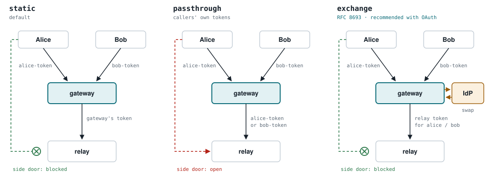

# Deploying the gateway in front of the relay

The gateway only protects what passes through it. If a client can also reach
the relay directly, it gets the relay's output unverified. So the one rule for
every deployment is:

**Only the gateway may reach the relay.**

How much depends on that rule changes with `UPSTREAM_MCP_AUTH_MODE`:

| Mode | A caller who reaches the relay directly… | Network isolation is |
|---|---|---|
| `static` | has no token the relay accepts | recommended |
| `passthrough` | **has one: their gateway token works at the relay too** | **required** |
| `exchange` | has a token made for the gateway, which the relay refuses | recommended, as a second layer |

<picture>
  <source media="(prefers-color-scheme: dark)" srcset="diagrams/relay-credential-modes-dark.svg">
  
</picture>

In `passthrough` mode the gateway logs `upstream.auth.passthrough` at startup
as a reminder, because it cannot see the network itself.

Three things make the rule hold:

1. **The relay is not published.** No host port, no Ingress, no reverse-proxy
   route points at it. Clients get the gateway's address and nothing else.
2. **A network rule lets only the gateway in.** A container network only the
   gateway shares, a firewall, or a Kubernetes NetworkPolicy.
3. **The relay keeps its own authentication on.** The network is one layer;
   the relay's token check is the other.

The relay's key endpoint (`/fence/public-key`) is fetched by the gateway, so it
sits behind the same rule. Give the relay a persistent key
(`FENCE_SIGNING_KEY_FILE`) and pin it in the gateway with `-pin`: an unpinned
key fetched over plain HTTP from another machine stops the gateway at startup.

## Podman / Docker Compose

This extends the relay's own `deploy/podman` setup. Today Caddy publishes the
relay at `https://<host>/mcp`. The changes put the gateway in its place and
give every hop a network of its own, so each service is reachable only from
the one in front of it:

| Network | Members | Purpose |
|---|---|---|
| `edge` | caddy, fence-gateway, searxng | what Caddy can reach |
| `relay` (internal) | fence-gateway, mcp-searxng-relay | the only way to the relay |
| `search` (internal) | mcp-searxng-relay, searxng | the relay's line to SearXNG |
| `egress` | mcp-searxng-relay | the relay's own route to the internet, shared with nobody |
| `backend` (internal) | searxng, valkey | unchanged |

Caddy is no longer on any network with the relay, so even a mistake in the
Caddyfile cannot route to it. The gateway is not on `search`: it only speaks
MCP to the relay and has no reason to reach SearXNG.

SearXNG stays on `edge` only if people use its web UI through Caddy. That is a
second front door, and anyone who gets through it can search without passing
the relay's auth, rate limits or audit log. So put single sign-on in front of
it (below). If only agents use SearXNG, take it off `edge` and drop its Caddy
route entirely.

`docker-compose.yaml`, the services that change:

```yaml
services:
  fence-gateway:
    image: ghcr.io/littleoffice/fence-gateway@sha256:<digest>   # pin a release digest
    container_name: fence-gateway
    env_file: ./envs/.fence-gateway.env
    command:
      - -upstream=http://mcp-searxng-relay:3000/mcp
      - -pin=<relay key fingerprint>      # from the relay's startup banner
      - -policy=reject
    cap_drop: [ALL]
    security_opt: [no-new-privileges:true]
    read_only: true
    networks: [edge, relay]
    depends_on: [mcp-searxng-relay]
    restart: unless-stopped

  mcp-searxng-relay:
    # ...as before, plus a persistent signing key so the pin survives restarts:
    environment:
      FENCE_SIGNING_KEY_FILE: /run/secrets/fence-key
    volumes:
      - ./secrets/fence-key.pem:/run/secrets/fence-key:ro
    networks: [relay, search, egress]      # was [edge]; no ports: section

  searxng:
    networks: [edge, search, backend]     # edge only for the web UI, behind SSO

networks:
  edge:
    internal: false
  relay:
    internal: true
  search:
    internal: true
  egress:
    internal: false
  backend:
    internal: true
```

Create the key once with `openssl genpkey -algorithm ed25519 -out secrets/fence-key.pem`
and `chmod 600` it. The relay's startup banner then shows the same fingerprint on
every start; that is the value for `-pin`.

`envs/.fence-gateway.env`, for a single user (`static` mode):

```bash
MCP_PORT=9090
MCP_AUTH_TOKEN=<the token your MCP client uses>
UPSTREAM_MCP_TOKEN=<the relay's MCP_AUTH_TOKEN>
MCP_STATELESS=true            # the same value as the relay's MCP_STATELESS
```

For several users set `UPSTREAM_MCP_AUTH_MODE=exchange` and the
`UPSTREAM_OAUTH_*` settings instead ([token exchange](token-exchange.md)).

`Caddyfile`, point `/mcp` at the gateway, and put the SearXNG web UI behind
single sign-on (here [oauth2-proxy](https://oauth2-proxy.github.io/oauth2-proxy/),
running as its own container on `edge`):

```caddyfile
handle_path /mcp* {
    reverse_proxy fence-gateway:9090 {
        flush_interval -1
    }
}

handle /oauth2/* {
    reverse_proxy oauth2-proxy:4180
}

handle {
    forward_auth oauth2-proxy:4180 {
        uri /oauth2/auth
        @unauthenticated status 401
        handle_response @unauthenticated {
            redir * /oauth2/sign_in?rd={scheme}://{host}{uri}
        }
    }
    reverse_proxy searxng:8080
}
```

Agents never go through oauth2-proxy: `/mcp` is bearer-only at the gateway.
The relay repository's `deploy/podman` ships this layout complete, with the
oauth2-proxy service and its settings.

**Check it.** From Caddy, the relay must be unreachable and the gateway
reachable:

```bash
podman exec caddy wget -qO- -T 5 http://mcp-searxng-relay:3000/health   # must fail: bad address
podman exec caddy wget -qO- -T 5 http://fence-gateway:9090/              # answers (401 without a token)
podman logs fence-gateway | grep -E 'fence.key.loaded|upstream.connected'
```

The gateway must not reach SearXNG either. Its image has no shell, so check
from a throwaway container sharing its network namespace:

```bash
podman run --rm --network container:fence-gateway docker.io/library/busybox \
  wget -qO- -T 5 http://searxng:8080/                                    # must fail: bad address
```

And from outside, the web UI must ask for a login:

```bash
curl -sI https://<host>/ | head -1                                       # 302 to /oauth2/sign_in
```

## Kubernetes / searxng-helm

The `searxng-helm` chart deploys the relay with its Ingress **off** and a
NetworkPolicy that admits **every pod in the namespace** (`allowSameNamespace:
true`). Narrow that to the gateway's pods.

Values for the relay instance:

```yaml
mcpRelay:
  enabled: true
  instances:
    - name: default
      fenceKey:
        existingSecret: relay-fence-key      # persistent key, so -pin survives rollouts
      ingress:
        enabled: false                       # clients reach the gateway, never the relay
      networkPolicy:
        ingress:
          allowSameNamespace: false
          from:
            - podSelector:
                matchLabels:
                  app.kubernetes.io/name: fence-gateway
```

The `from:` entries are ordinary NetworkPolicy peers. If the gateway runs in
another namespace, put both selectors in one peer:

```yaml
          from:
            - namespaceSelector:
                matchLabels:
                  kubernetes.io/metadata.name: mcp-gateway
              podSelector:
                matchLabels:
                  app.kubernetes.io/name: fence-gateway
```

The gateway itself runs as its own Deployment with the label
`app.kubernetes.io/name: fence-gateway`, an Ingress (with TLS) for the clients,
and `-upstream http://<release>-searxng-mcp-relay.<namespace>.svc:8080/mcp`.
Its own NetworkPolicy needs egress to the relay, to DNS, and, in `exchange`
mode or with OAuth, to the identity provider.

Two things to know:

- **NetworkPolicy needs a CNI that enforces it** (Calico, Cilium and most
  managed offerings do; plain Flannel does not). Without one the rule above is
  accepted and does nothing.
- **Probes and scraping are separate.** Kubelet health probes are not subject
  to NetworkPolicy, and the chart's Prometheus rule for `/metrics` is its own
  entry; neither needs the gateway's selector.

**Check it.** From a throwaway pod in the namespace the relay must be
unreachable:

```bash
kubectl -n <ns> run probe --rm -it --restart=Never --image=curlimages/curl -- \
  curl -sS -m 5 http://<release>-searxng-mcp-relay:8080/health      # must time out
```

and the gateway's log must show `fence.key.loaded` and `upstream.connected`.
