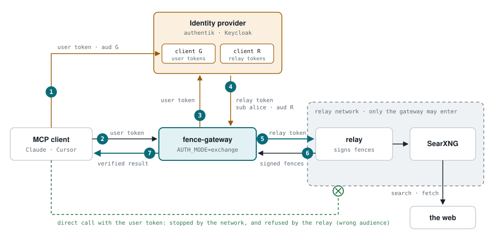

# Token exchange (`UPSTREAM_MCP_AUTH_MODE=exchange`)

In `exchange` mode the gateway never forwards a caller's token to the relay. It
trades it at your identity provider for a token issued to the relay, for the
same user ([RFC 8693](https://www.rfc-editor.org/rfc/rfc8693)), and presents
that. The caller's own token only works at the gateway, so reaching the relay
directly gets a caller nowhere.

<picture>
  <source media="(prefers-color-scheme: dark)" srcset="diagrams/token-exchange-flow-dark.svg">
  
</picture>

1. The MCP client logs in at the identity provider and gets a user token made for the gateway (client G).
2. It calls the gateway with that token, which the gateway checks.
3. The gateway sends the user token to the provider's token endpoint as a token exchange, signing in as client R.
4. The provider returns a relay token for the same user. The gateway caches it until shortly before it expires.
5. The gateway calls the relay with the relay token; the relay files history and limits under that user.
6. The relay answers with signed fences.
7. The gateway verifies every fence, then answers the client.

How this compares with the other two modes:

<picture>
  <source media="(prefers-color-scheme: dark)" srcset="diagrams/relay-credential-modes-dark.svg">
  
</picture>

Any provider that implements RFC 8693 works. This page covers authentik and
Keycloak.

## What each side needs

| Where | Setting | Value |
|---|---|---|
| Identity provider | a client for the gateway's **callers** | issues the tokens MCP clients log in with |
| Identity provider | a client for the **relay** | issues the exchanged tokens; allowed to exchange tokens from the callers' client |
| Gateway | `MCP_OAUTH_ISSUER`, `MCP_OAUTH_AUDIENCE` | the callers' client: which tokens the gateway accepts |
| Gateway | `UPSTREAM_MCP_AUTH_MODE` | `exchange` |
| Gateway | `UPSTREAM_OAUTH_TOKEN_URL` | the provider's token endpoint |
| Gateway | `UPSTREAM_OAUTH_CLIENT_ID`, `UPSTREAM_OAUTH_CLIENT_SECRET[_FILE]` | the client the gateway exchanges with |
| Gateway | `UPSTREAM_OAUTH_AUDIENCE` | optional: the relay's client ID, sent as `audience` |
| Gateway | `UPSTREAM_OAUTH_DELEGATION` | optional: `true` to record the gateway as acting for the user (`act` claim) |
| Relay | `MCP_OAUTH_ISSUER`, `MCP_OAUTH_AUDIENCE` | the relay's client: which tokens the relay accepts |

The gateway also needs a credential for its own housekeeping with the relay
(`initialize` and `tools/list` at startup, before any caller exists). It asks
the provider for a client-credentials token with the same client. If your
provider does not issue one that way, set `UPSTREAM_MCP_TOKEN` to a static token
the relay accepts instead; it takes precedence.

The gateway caches each exchanged token until 30 seconds before it expires, so
a caller costs one round trip to the provider per token lifetime, not one per
tool call.

## authentik

Token exchange is a grant type on authentik's OAuth2 provider, off by default.
On-behalf-of delegation (`actor_token`, the `act` claim) needs authentik
2026.8 or newer.

1. **Provider G** (callers): an OAuth2/OpenID provider and application for the
   MCP clients. Its issuer (`https://<authentik>/application/o/<slug>/`) and
   client ID go into the gateway's `MCP_OAUTH_ISSUER` and `MCP_OAUTH_AUDIENCE`.
2. **Provider R** (relay): a second OAuth2/OpenID provider and application,
   confidential client.
   - Under **Grant Types**, enable token exchange.
   - Under the machine-to-machine settings, add provider **G** to
     **Federated OAuth2/OpenID Providers**, so R trusts G's tokens as subject
     tokens (and, for delegation, the gateway's own tokens as actor tokens).
   - Its client ID and secret go into the gateway's `UPSTREAM_OAUTH_CLIENT_ID`
     and `UPSTREAM_OAUTH_CLIENT_SECRET`.
   - Its issuer and client ID go into the relay's `MCP_OAUTH_ISSUER` and
     `MCP_OAUTH_AUDIENCE`.
3. `UPSTREAM_OAUTH_TOKEN_URL` is authentik's token endpoint,
   `https://<authentik>/application/o/token/`.

Check the names against your version's
[token exchange documentation](https://docs.goauthentik.io/add-secure-apps/providers/oauth2/token_exchange/).

## Keycloak

Keycloak's standard token exchange (26.2 and newer) lets a client exchange a
token that was issued with that client in its audience.

1. **Callers' client**: the client the MCP clients log in with. Add an audience
   mapper so its tokens also carry the **gateway** client in `aud`.
2. **Gateway client**: confidential, with **Standard token exchange** enabled
   and service accounts on (for its own housekeeping token). Its ID and secret
   go into `UPSTREAM_OAUTH_CLIENT_ID` / `UPSTREAM_OAUTH_CLIENT_SECRET`.
3. **Relay client**: the target. Set `UPSTREAM_OAUTH_AUDIENCE` to its client ID.
   The relay's `MCP_OAUTH_AUDIENCE` is the same ID and its `MCP_OAUTH_ISSUER` is
   the realm URL.
4. `UPSTREAM_OAUTH_TOKEN_URL` is
   `https://<keycloak>/realms/<realm>/protocol/openid-connect/token`.

Leave `UPSTREAM_OAUTH_DELEGATION` off unless your Keycloak version supports
`actor_token`.

## Trying it by hand

Before starting the gateway, exchange a real token with `curl`. If this works,
the gateway will too:

```bash
curl -s -u "$CLIENT_ID:$CLIENT_SECRET" "$TOKEN_URL" \
  -d grant_type=urn:ietf:params:oauth:grant-type:token-exchange \
  -d subject_token="$USER_TOKEN" \
  -d subject_token_type=urn:ietf:params:oauth:token-type:access_token \
  -d requested_token_type=urn:ietf:params:oauth:token-type:access_token
```

Decode the returned `access_token` and check that `sub` is the user, `aud` is
the relay's client, and `iss` is what the relay's `MCP_OAUTH_ISSUER` says.

## What still to know

- **Rate limits at the relay.** The relay keys its per-caller rate limit on
  static-token identities and falls back to the client IP for OAuth callers.
  Behind a gateway, every OAuth caller then shares one limit until the relay
  keys it on the OAuth subject.
- **Keep the relay network-isolated anyway.** Exchange makes a caller's own token
  useless at the relay; allowing only the gateway to reach it is still the
  second layer.
- **Failures fail closed.** A caller whose token the provider refuses, or who
  holds a static gateway token, gets a blocked tool call; the reason goes to the
  audit log as `upstream.exchange.failed`. Nothing is sent under another
  credential.
